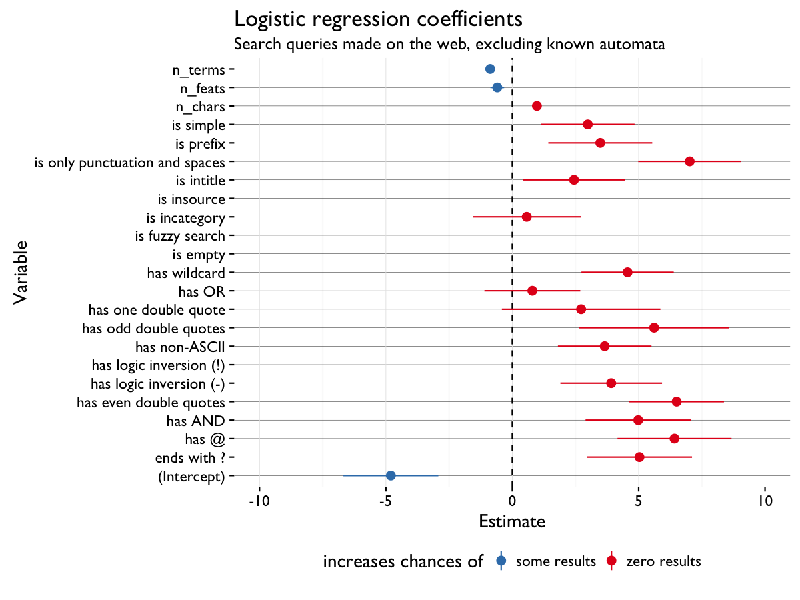

```{r setup, include = FALSE}
knitr::opts_chunk$set(echo = FALSE, message = FALSE, warning = FALSE)
```

\renewcommand{\abstractname}{Executive Summary}
\begin{abstract}
The Discovery Department uses the zero results rate -- the proportion of searches that yield zero results -- to measure the performance of our search system. However, little is known about possible patterns that affect the quantity (and quality) of results our users see. In this report, we use random forest and logistic regression models to shed light on the types of queries that tend to yield zero results.

Namely, we found that whether the query has an even number of double quotes is one of the most important indicators of whether it will yield zero results. Other notable features that impact the quantity of results include: whether the query is only punctuation and spaces, whether it ends with ?, and whether it has logical operators. For a full list of features and their importance and impact, please see Figures 4 and 5.
\end{abstract}

## Introduction

One of Discovery/Search team's key performance indicator (KPI) metrics is the zero results rate -- the proportion of searches that yield zero results. However, little is known about possible patterns that affect the search engine as it retrieves potential matches for the user-provided query. If we don't know which types of queries are more or less likely than others to yield zero results, that makes it extremely challenging to come up with configuration tweaks and other modifications that address particular types of queries, and ultimately help the user discover the content they are searching for.

This report attempts to bring to light those patterns which affect the chances of getting zero or some results. First we deconstruct a large set of queries into descriptive features. Then we use two classification methods which allow us to make inference on those extracted features. Random forests enable us to assess how important certain features are (through various variable importance measures) in classification, while logistic regression enables us to asses the magnitude and direction of a feature's impact on the probability of zero results.

## Methods

On 24 February 2016 we completed a Hive user-defined function (UDF) for deconstructing search queries into various features (see Patch [254461](https://gerrit.wikimedia.org/r/#/c/254461/)). The UDF detects a variety of features such as: odd or even number of quotation marks, logical operators (e.g. AND, OR), "prefix:" or "insource:", and wildcards. For a full list of features, please see [T118218](https://phabricator.wikimedia.org/T118218) and [SearchQuery.java](https://git.wikimedia.org/blob/analytics%2Frefinery%2Fsource.git/master/refinery-core%2Fsrc%2Fmain%2Fjava%2Forg%2Fwikimedia%2Fanalytics%2Frefinery%2Fcore%2FSearchQuery.java) and [SearchQueryFeatureRegex.java](https://git.wikimedia.org/blob/analytics%2Frefinery%2Fsource.git/master/refinery-core%2Fsrc%2Fmain%2Fjava%2Forg%2Fwikimedia%2Fanalytics%2Frefinery%2Fcore%2FSearchQueryFeatureRegex.java) source code.

We extracted 5.7 million queries made on the web -- and excluding known automata -- to train a random forest (an ensemble classification algorithm) on queries yielding zero or some results. We decided to grow a random forest because this particular classification algorithm allows us to assess the importance of different features (see [variable importance](https://en.wikipedia.org/wiki/Random_forest#Variable_importance)). We deconstructed the queries into "query features" (yielding an indicator matrix of 1s and 0s) and combined that with other statistics (number of terms, number of characters, and number of features detected) to construct a final feature matrix used to grow the random forest. We considered including country as a predictor but early parameter tuning tests showed that a small increase in prediction accuracy was not enough to offset the time it would take to train the algorithm on a feature space with 234 additional dimensions (one per each country observed).

A random 80% subset of the data was used to grow the trees, with the remainder 20% as out-of-bag (OOB) data for assessing classification error and variable importance. In particular, we use the *Mean Decrease Gini* (MDI) and *Mean Decrease Accuracy* (MDA) to find the features which have the most impact on classification, and thus may provide us with ideas about what we can tweak to make search better. MDA works such that if a variable $X_j$ is associated to response $Y$, then randomly permuting its values should result in a substantial decrease in the accuracy of the classification.

Additionally, we used logistic regression on 1% of the data to assess the magnitude and the direction of the features' effects on the query yielding some or zero results.

## Results

Figures 1--3 on the following pages break down the zero results by country, extracted feature, and combination of extracted features. Figures 4 and 5 in the Random Forest and Logistic Regression sections, respectively, compare the impact those features have in the context of predicting zero results. Figure 6 compares the features using the measures from both models to reveal which features the two models agree on.

## References

Random forest. URL https://en.wikipedia.org/wiki/Random_forest

Louppe, G. (2014, July 28). Understanding Random Forests: From Theory to Practice.

Hastie, T., Tibshirani, R., & Friedman, J. (2009). The Elements of Statistical Learning. New York, NY: Springer Science & Business Media. http://doi.org/10.1007/978-0-387-84858-7

A. Liaw and M. Wiener (2002). Classification and Regression by randomForest. R News 2(3), 18--22.
  
R Core Team (2016). R: A language and environment for statistical computing. R Foundation for Statistical Computing, Vienna, Austria. URL https://www.R-project.org/.

\newpage


\newpage


\newpage


\newpage

\begin{landscape}

\subsection{Classification via Random Forest}

\begin{figure}[h!]
\centering
\includegraphics{figures/web/excl_known_automata/var_imp.png}
\caption{\textbf{(a)} Variable importance according to mean decrease in accuracy (increase in prediction error after permuting values of the predictor) \emph{specific to zero results queries}. \textbf{(b)} Variable importance according to mean decrease in impurity, using Gini index. \textbf{(c)} Variable importance according to mean decrease in accuracy over both classes of queries (zero results and some results).}
\label{fig:var_imp}
\end{figure}

In Figure \ref{fig:var_imp} above, we can see that across the battery of variable importance metrics, having an even number of double quotes is 1 of the 2 most important indicators of whether the query will have some or zero results. This makes sense because the engine will look for exact matches to each quoted segment of the query, meaning less documents will be retrieved. Other high-importance features make a lot of logical sense, such as whether the query includes the OR operator or whether it's only punctuation and spaces.

\end{landscape}

\newpage

### Classification via Logistic Regression



The two models reveal a similar set of high-impact features, namely:

- Queries with an even number of " marks
- Queries that are just punctuation and spaces (obvious)
- Queries with wildcards (less obvious)
- Queries that end with ?
- Queries with @ (emails, possibly?)
- Queries that have the operators AND and OR

In Figure \ref{fig:mda_coef} below, we can see which features the two models agree on as having a relationship with the results the query yields. Specifically, they agree on the following features that are important -- with respect to various mean decrease accuracies (MDAs) -- and make zero results more likely: has even double quotes, has the at symbol, is prefix, has logic inversion, and ends with a question mark.

\newpage

\begin{landscape}

\begin{figure}[h!]
\centering
\includegraphics{figures/web/excl_known_automata/mda_logitcoef.png}
\caption{A scatter map of features with respect to variable importance (via relative mean decrease metrics) and logistic regression coefficient estimates. The plot is divided into quadrants according to how important or unimportant the feature is in random forest classification and whether a query having the feature is more or less likely to yield zero results.}
\label{fig:mda_coef}
\end{figure}

\end{landscape}
